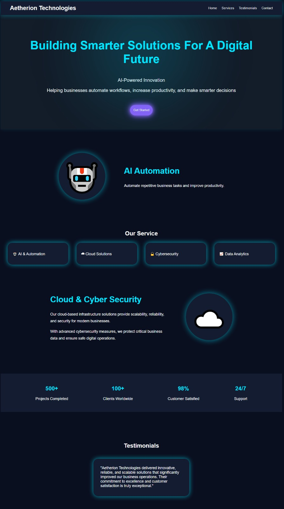
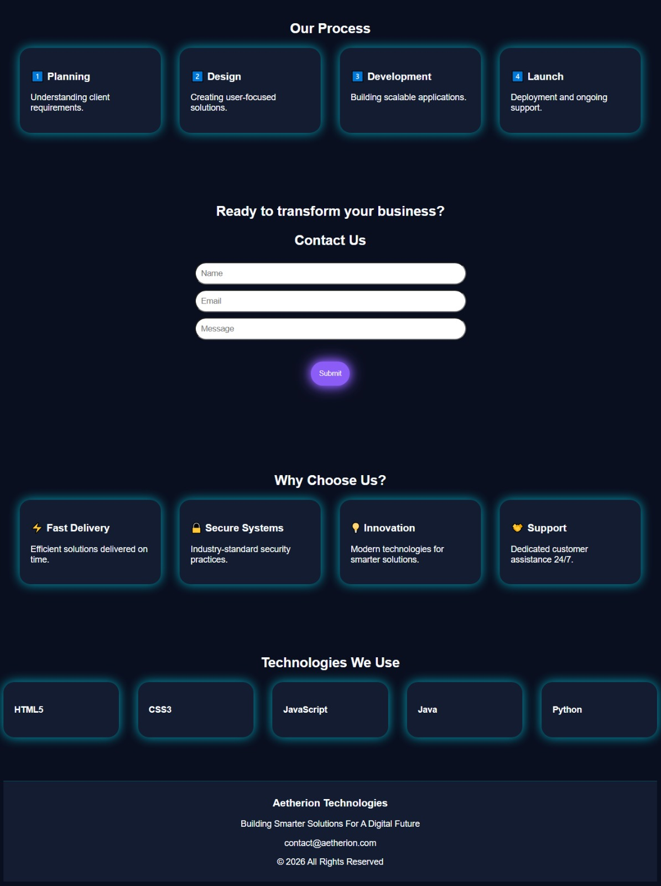
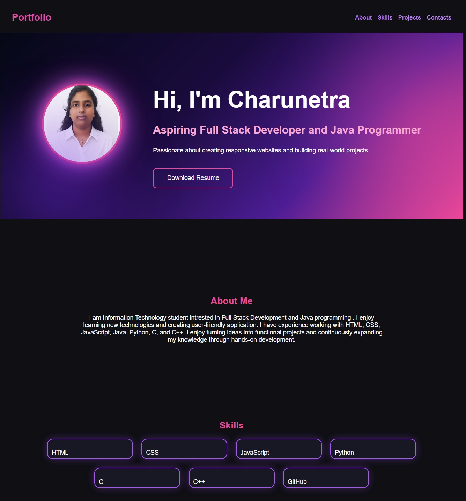
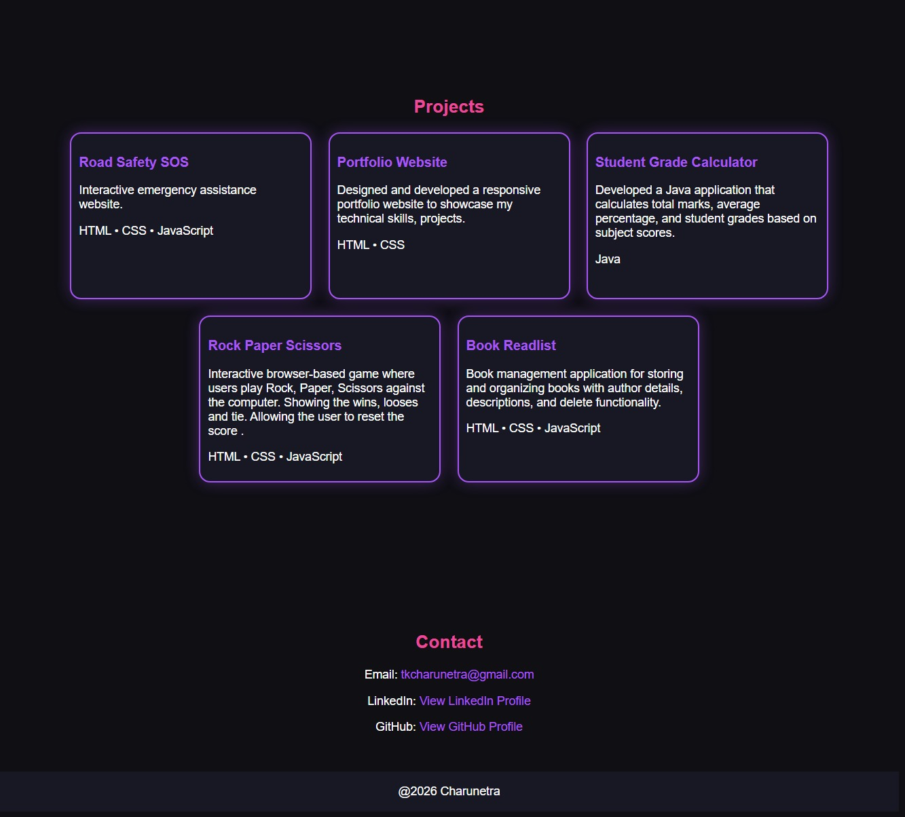
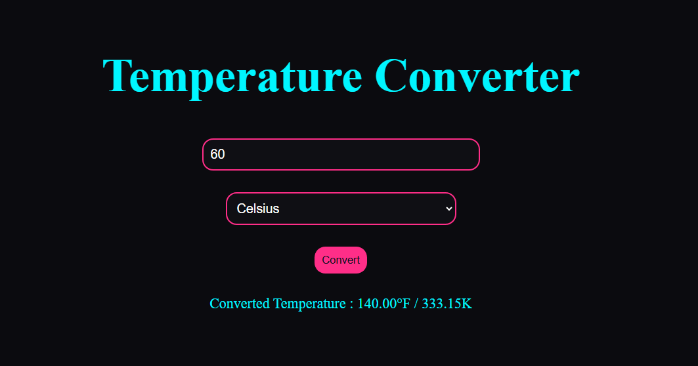

# OIBSIP

## About
This repository contains all the projects completed during my Web Development & Designing Internship at Oasis Infobyte. Each task focuses on improving front-end development skills using HTML, CSS, and JavaScript.

# Task 1: Aetherion Technologies Landing Page

## Description

Aetherion Technologies is a modern and responsive landing page designed for a fictional technology company. The website showcases the company's services, business statistics, testimonials, development process, technologies used, and contact information through a visually appealing futuristic design.

## Features

* Sticky Navigation Bar
* Hero Section with Call-to-Action Button
* AI-Powered Solutions Feature Section
* Services Section
* Business Statistics Dashboard
* Customer Testimonials
* Our Process Section
* Why Choose Us Section
* Technologies We Use Section
* Contact Form
* Professional Footer
* Modern Dark Theme with Glow Effects

## Technologies Used

* HTML5
* CSS3
* Flexbox
* CSS Box Shadows
* Responsive Design Principles

## Concepts Used

* Semantic HTML
* Flexbox Layout
* Positioning (Sticky Navigation)
* Pseudo Elements (::before)
* CSS Transitions
* Box Shadows & Glow Effects
* Responsive Web Design Basics

## Output

The landing page provides:

* A professional company introduction
* Service offerings
* Company achievements and statistics
* Customer testimonials
* Business workflow explanation
* Technology stack overview
* Contact section for user inquiries

## Screenshots

### Home Page

Displays the navigation bar, hero section, and call-to-action button.

### Services Section

Showcases the key services provided by Aetherion Technologies.

### Statistics & Testimonials

Highlights company achievements and customer feedback.

### Contact Section

Allows users to submit inquiries through a simple contact form.

## Learning Outcomes

* Improved HTML structuring skills
* Enhanced CSS styling techniques
* Learned Flexbox for layouts
* Implemented hover effects and visual enhancements
* Developed a complete landing page from scratch
* Gained practical experience in UI design

-------------------------------------------------------

# Task 2: Portfolio website

## Description
A responsive personal portfolio website developed to showcase my skills, projects, and contact information. The website features a modern dark-themed design with interactive hover effects and smooth navigation.

## Features
* Responsive portfolio design
* Sticky navigation bar
* Smooth scrolling between sections
* About Me section
* Skills showcase
* Project showcase cards
* Contact section with clickable links
* Hover animations and glowing effects
* Modern dark UI with purple and pink theme

## Technologies Used
* HTML5
* CSS3

## Concepts Used
* HTML5
* CSS3
* Flexbox Layout
* CSS Gradients
* CSS Transitions
* Hover Effects
* Smooth Scrolling
* External Hyperlinks

## Output

The website successfully displays personal information, technical skills, projects, and contact details in a visually appealing and professional portfolio format.

##Screenshot

## Learning Outcome
* Improved HTML and CSS skills through hands-on development.
* Learned to create responsive and visually appealing web pages.
* Gained experience with layouts, navigation, hover effects, and styling techniques.
* Developed a professional portfolio to showcase skills and projects.

-----------------------------------------------------------

# Task 3: Temperature Converter

## Description

The Temperature Converter is a simple and interactive web application that allows users to convert temperature values between Celsius, Fahrenheit, and Kelvin. The project provides an easy-to-use interface with instant conversion results and input validation.

## Features
* Convert Celsius to Fahrenheit and Kelvin
* Convert Fahrenheit to Celsius and Kelvin
* Convert Kelvin to Celsius and Fahrenheit
* User-friendly interface
* Input validation for numeric values
* Instant temperature conversion
* Responsive and modern design

## Technologies Used
* HTML5
* CSS3
* JavaScript

## Concepts Used
* HTML Forms
* CSS Styling
* JavaScript Functions
* DOM Manipulation
* Event Handling
* Conditional Statements
* User Input Validation

## How It Works
* Enter a temperature value.
* Select the temperature unit (Celsius, Fahrenheit, or Kelvin).
* Click the Convert button.
* View the converted temperature instantly.

 
## Output

 

 
 ## Learning Outcomes

Through this project, I learned:

* Handling user input using JavaScript
* Working with temperature conversion formulas
* DOM manipulation and event handling
* Creating responsive user interfaces
* Input validation techniques

## Author

T.K.Charunetra

Oasis Infobytes Intern

